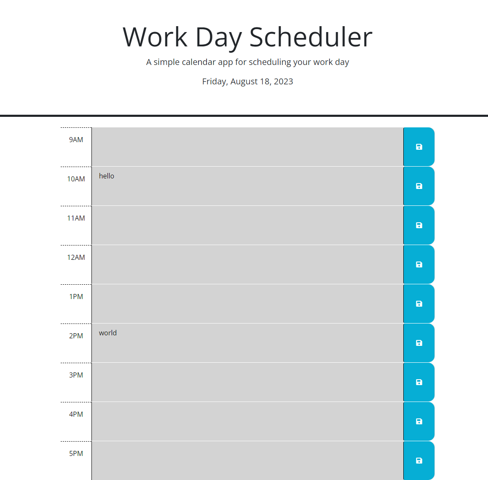

# Work-Day-Scheduler

## Description
This repository allows users to save events for each hour of a typical work day.

To view the Webpage click [here] (https://patrickodea.github.io/Work-Day-Scheduler/).

## Usage
Users can type information for the specific time of day, and click the save icon to locally save the data to their computer.

The time at the top updates according to the day the web page is viewed.